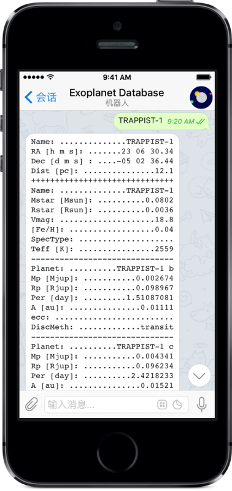
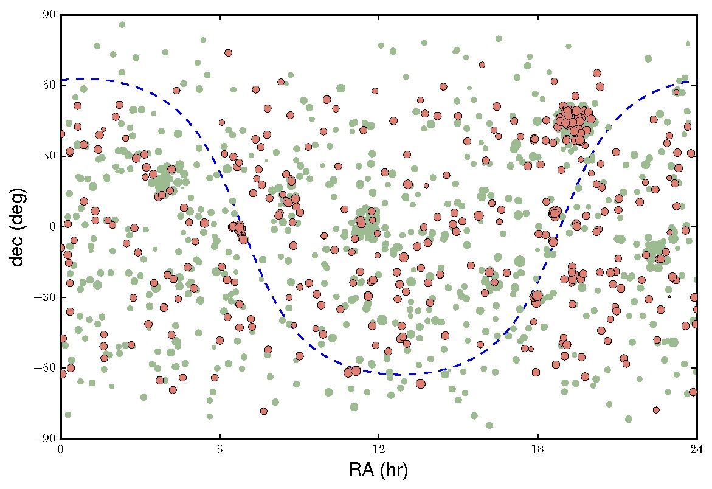
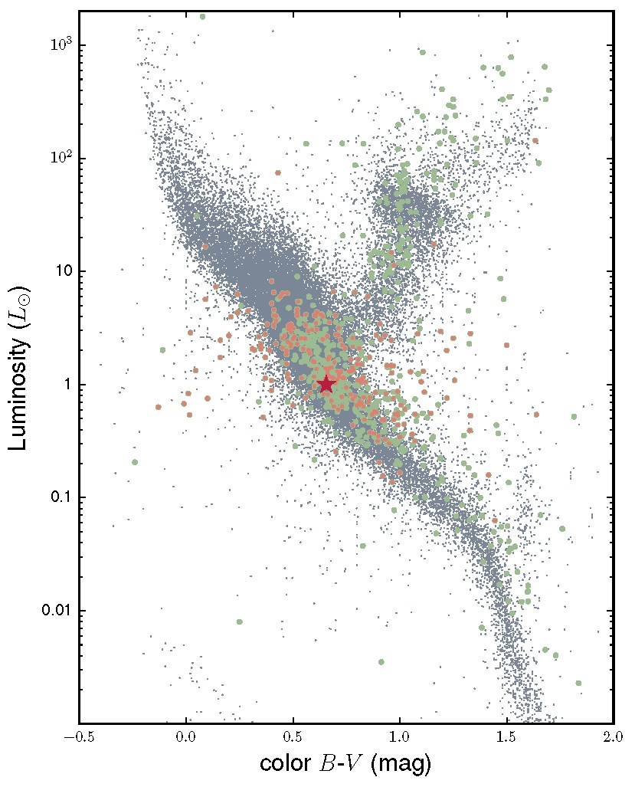

# ExoPlanetList -- Total Planet Number = 3701
List of hand-picked exoplanets

> Created for my Phd Dissertation.

### [Telegram Bot](https://telegram.me/exoplanets_bot) 


### Wechat Bot


###一些约定：

- mainly based on `exoplanet.org`
- name alias choose Simbad `main_id`
- `Kepler` prior to `KOI`
- binary star keep `A` and/or `B` within name
- avoid use aconyms like `alp` but `alpha`
- avoid special chars like `'`
- alpha ahead of number `Oph 11 b` instead of `11 Oph b`
- `K2` instead of `EPIC`
- `PH` instead of `Kepler`
- `KELT` instead of `WASP`

Special thanks to:

1. [exoplanets.org](http://exoplanets.org/)
2. [NASA Exoplanet Archive](http://exoplanetarchive.ipac.caltech.edu/index.html)
3. [exoplanets.eu](http://exoplanets.eu/)
4. [Open Exoplanet Catalog](https://github.com/OpenExoplanetCatalogue/open_exoplanet_catalogue)
5. [astronexus](https://github.com/astronexus/HYG-Database)
6. [TEPCat](http://www.astro.keele.ac.uk/jkt/tepcat/rossiter.html)

~~`.csv` file on the way~~






---
Columns:
```
num
plname
Per
Mp
SMA
ecc
inc
Rp
lambda
b
ncomp
dismet
year
RA
dec
BmV
Vmag
dist
Mstar
Rstar
Teff
logg
FeH
PerErrU
MpErrU
SMAErrU
eccErrU
incErrU
RpErrU
lambdaErrU
bErrU
distErrU
MstarErrU
RstarErrU
TeffErrU
loggErrU
FeHErrU
PerErrL
MpErrL
SMAErrL
eccErrL
incErrL
RpErrL
lambdaErrL
bErrL
distErrL
MstarErrL
RstarErrL
TeffErrL
loggErrL
FeHErrL
Vsini
VsiniErrU
VsiniErrL
age
ageErrU
ageErrL
SHK
RHK
```
